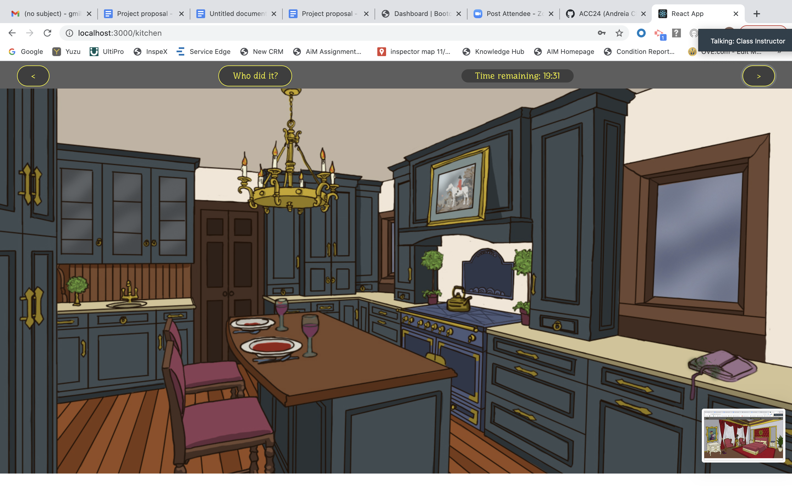
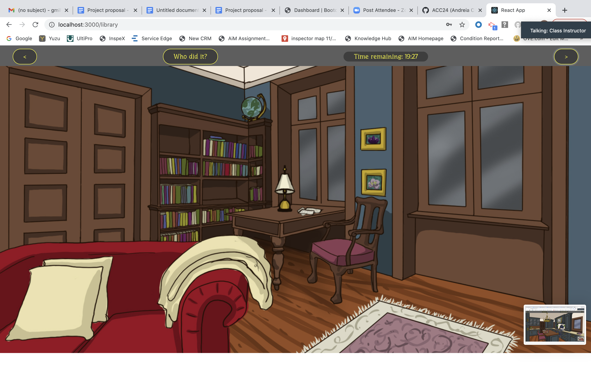

# Murder-Mystery-Game

This application is a murder mystery game for the user who just wants to get their mind off of what all is going on in 2020. People are looking to have some fun while being safe during this pandemic.

## Technologies

This application used the following technologies: React-redux, Redux, Adobe Photoshop, React, Mongobd, Mongoose, Passport, Reactstrap, React-image-mapper, .jwt-decode

## User Story

As the user

- I WANT to help find the murderer by searching through the different rooms by clicking clues
- SO THAT I can help solve the case and win the game
  GIVEN the landing page, I can login or register
  WHEN I login in
  THEN I am given the synopsis of the murder and the names of the main characters
  WHEN I hit start
  THEN I start the timed game
  WHEN I click on clues
  THEN I move on to different rooms
  WHEN I guess the murderer
  THEN I either win or lose the game
  WHEN I end the game
  THEN I go to the scoreboard
  THEN I can restart or logout

## Deployed Application

https://rocky-forest-45665.herokuapp.com/

### Contributors

Please contact Andreia Chapman, Eugenia Solana, or Georgia Milteer
https://github.com/eugesol
https://github.com/gmilteer
https://github.com/ACC24

## Visuals

## Future Developments

    1. Add more story lines and murderers
    2. Add more dynamic features
    3. Include more animation.
